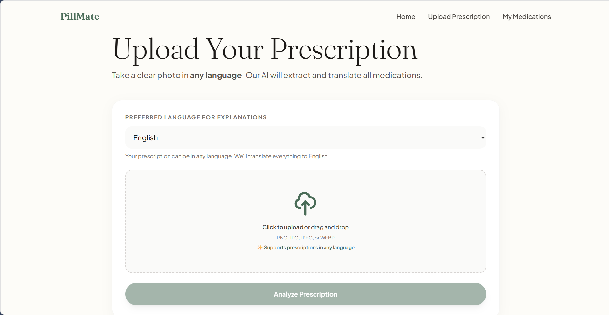
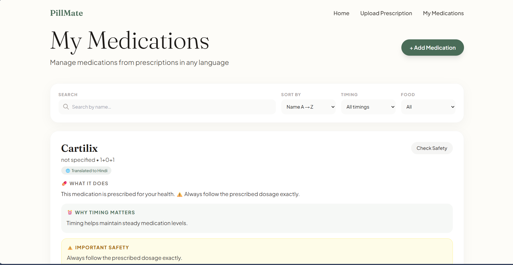
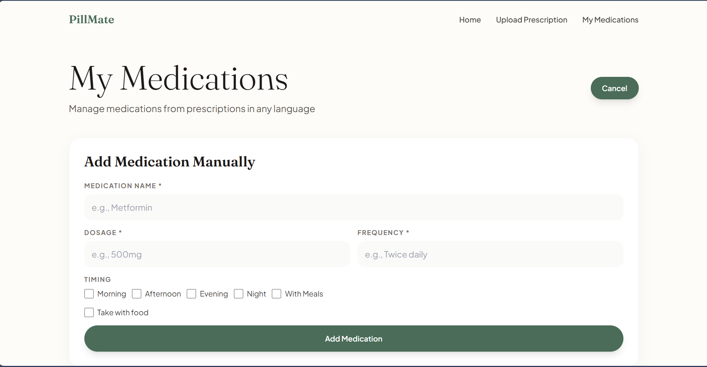

# PillMate

A multi-language prescription analysis and medication management platform powered by AI. PillMate helps users understand their prescriptions, track medications, and stay on top of their health — all in plain, simple language.

## Features

- **Prescription Upload & Analysis** — Upload a photo of your prescription in any language. The AI extracts medication details automatically.
- **Multi-Language Support** — Supports 10 languages: English, Spanish, Hindi, Arabic, Chinese, French, German, Portuguese, Russian, and Japanese.
- **Plain-Language Explanations** — Get easy-to-understand explanations of what each medication does and why timing matters. No medical jargon.
- **Behavioral Nudges** — Built on Nudge Theory to help improve medication adherence through motivational reminders.
- **Drug Interaction Checks** — Check for basic contraindications between your medications.
- **Medication Tracking** — View and manage all your medications in one place.

## Tech Stack

### Frontend
- **React 19** with React Router
- **Tailwind CSS** for styling
- **Radix UI** component primitives
- **CRACO** for custom webpack configuration
- **Axios** for API communication

### Backend
- **FastAPI** (Python)
- **MongoDB** via Motor (async driver)
- **Google Gemini AI** (gemini-3-flash-preview) for prescription analysis and medication explanations
- **Pydantic** for data validation

## Prerequisites

- **Node.js** (v18+)
- **Python** (v3.10+)
- **MongoDB** running locally on port 27017
- **Google Gemini API Key** — get one at [https://aistudio.google.com/apikey](https://aistudio.google.com/apikey)

## Getting Started

### 1. Clone the repository

```bash
git clone https://github.com/pvsaravanan/PillMate.git
cd PillMate
```

### 2. Backend setup

```bash
cd backend
pip install -r requirements.txt
```

Create a `.env` file in the `backend/` directory:

```env
MONGO_URL=mongodb://localhost:27017
DB_NAME=pillguide_local
CORS_ORIGINS=http://localhost:3000
GEMINI_API_KEY=your_gemini_api_key_here
```

Start the backend server:

```bash
python -m uvicorn server:app --host 0.0.0.0 --port 8001
```

### 3. Frontend setup

```bash
cd frontend
npm install
```

Create a `.env` file in the `frontend/` directory:

```env
REACT_APP_BACKEND_URL=http://localhost:8001
```

Start the frontend dev server:

```bash
npm start
```

The app will be available at [http://localhost:3000](http://localhost:3000).

## Screenshots

### Home Page


### Upload Prescription


### My Medications


### Add Medication


## API Endpoints

| Method | Endpoint | Description |
|--------|----------|-------------|
| GET | `/api/` | Health check |
| GET | `/api/languages` | List supported languages |
| POST | `/api/prescriptions/upload` | Upload and analyze a prescription image |
| GET | `/api/prescriptions` | Get all prescriptions |
| POST | `/api/medications` | Add a medication manually |
| GET | `/api/medications` | Get all medications |
| POST | `/api/contraindications/check` | Check drug interactions |

## Project Structure

```
PillMate/
├── backend/
│   ├── server.py            # FastAPI application
│   ├── requirements.txt     # Python dependencies
│   └── .env                 # Environment variables
├── frontend/
│   ├── public/              # Static assets
│   ├── src/
│   │   ├── App.js           # Root component with routing
│   │   ├── pages/
│   │   │   ├── HomePage.js
│   │   │   ├── UploadPage.js
│   │   │   └── MedicationsPage.js
│   │   ├── components/ui/   # Radix UI components
│   │   ├── hooks/
│   │   └── lib/
│   ├── package.json
│   └── .env                 # Frontend environment variables
└── README.md
```

## Documentation

- [Algorithms](docs/ALGORITHMS.md) — Details on the AI-powered prescription analysis and medication explanation algorithms.
- [Architecture](docs/ARCHITECTURE.md) — System architecture, data flow, and design decisions.
- [Features](docs/FEATURES.md) — Comprehensive feature descriptions and usage.

## License

This project is for educational and personal use.
